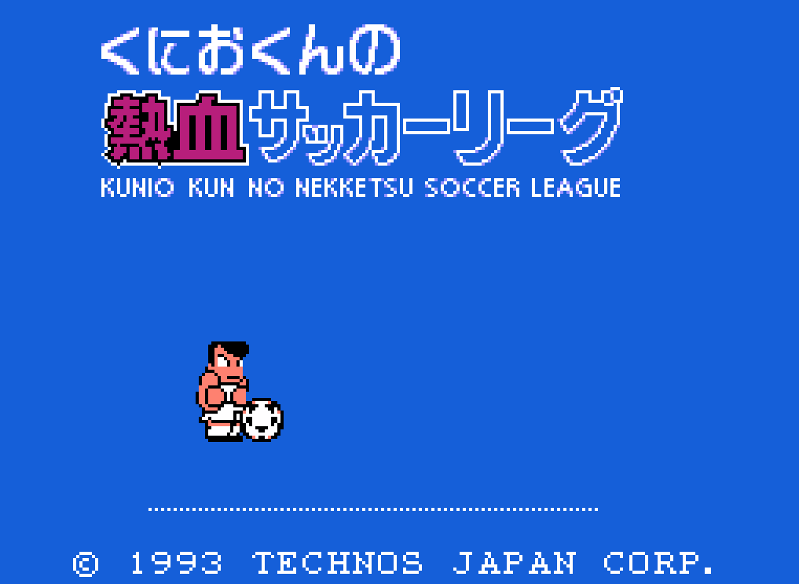

# goal3-warmup-web



The ball-practice warm-up screen of *Kunio-kun no Nekketsu Soccer League* (くにおくんの熱血サッカーリーグ,
Technōs Japan, Famicom, 1993; known as *Goal 3*), rebuilt for the web as a fan tribute. The player
and the ball follow the original's rules, checked frame by frame against recordings of the original
running in an emulator, and the music and sound effects are played by an emulated NES sound chip.

**Play it: https://mperor.github.io/goal3-warmup-web/**

Plain HTML, CSS and JavaScript modules: no build step, no dependencies.

## Running

The page loads JavaScript modules and an audio worklet, which browsers do not allow from `file://`.
Serve the folder over HTTP, for example:

```sh
npx serve .
# or
py -m http.server
```

and open the address it prints. Every push to `master` publishes the page on GitHub Pages
(`.github/workflows/pages.yml`).

## Controls

| Key        | Famicom | Action                     |
|------------|---------|----------------------------|
| Left Right | ←→      | move (tap twice: run)      |
| Up Down    | ↑↓      | move up and down the pitch |
| X          | A       | pass, kick                 |
| Z          | B       | shoot, dive                |
| Space      | A+B     | jump                       |
| Esc        |         | the menu window            |
| M          |         | sound on / off             |

A gamepad works too: the d-pad or the left stick, A on the right face button, B on the bottom one,
START for the menu window (a browser may still want a key press, click or touch before it plays
sound). On a touch screen the page shows a d-pad, B, A, A+B and START; phones
are best held sideways, and where the browser allows it the menu has a full screen switch.

## Layout

```
index.html, css/       the scene
js/game/               player and ball logic, input, the fixed-step loop, rendering
js/audio/              NES sound chip (APU) emulation in an AudioWorklet, the captured song and effects
js/art/                sprites, the title logo and the press-start prompt as pixel data
js/pixel-*.js          bitmap text and pixel art rendering
js/touch.js            touch controls and full screen
js/scale.js            snaps the scale to whole screen pixels
fonts/                 local fonts (SIL OFL 1.1)
docs/reference/        reference images and the Mesen movie the tools start from
tools/                 the tools that capture data from the original and check the game against it
```

## Tools

The data in `js/art/` and `js/audio/sound-data.js` is generated from the original game, and the game
logic is compared with it. None of this is needed to run the page. The tools need Node.js 18+,
Python 3.10+ (stdlib only), [Mesen 2.2.1](https://www.mesen.ca/) and **your own dump of the
original cartridge** at `rom/nsl-jp.nes` (git-ignored; no ROM is part of this repository).
`tools/record_gif.mjs`, `tools/render_audio.mjs` and `tools/gen_favicon.mjs` only need Node.js.

| Tool                         | What it does                                                                 |
|------------------------------|------------------------------------------------------------------------------|
| `tools/simulate.py`          | plays input plans on the original in Mesen (headless), from `docs/reference/movies/nsl-jp.mmo` |
| `tools/compare_sim.mjs`      | runs the same plans through the game logic and reports where they differ     |
| `tools/capture_audio.py`     | captures the music and effects from the original, writes `js/audio/sound-data.js` |
| `tools/render_audio.mjs`     | renders the captured sound to WAV files, to listen outside the browser       |
| `tools/mesen/*.lua`          | Mesen scripts: frame dumps of RAM and OAM, PPU snapshots, sound chip logs    |
| `tools/export_trace.py`      | exports frame dumps in `tools/data/` as JSON for `tools/check_replay.mjs`   |
| `tools/check_replay.mjs`     | replays recorded play sessions through the game logic and compares with RAM  |
| `tools/gen_sprites.py`       | builds `js/art/sprites.js` from the frame dumps and a PPU snapshot           |
| `tools/gen_favicon.mjs`      | draws the favicon from the ball sprite                                       |
| `tools/record_gif.mjs`       | records a GIF of the screen from the game logic on a scripted input plan; with `--preview`, `preview.png` |

The play-session recordings in `tools/data/` are local and not committed; record your own with
`tools/mesen/frame-dump.lua` and `tools/mesen/export-screen.lua` (see `tools/recording.py`).
Generated files go to `tools/.cache/` (git-ignored).

## Legal

This is a non-commercial fan project, not affiliated with or endorsed by the rights holders.
*Kunio-kun no Nekketsu Soccer League* and its characters, graphics, music and sound belong to
their owners; the Kunio-kun series has belonged to Arc System Works since 2015.

The following is derived from the original game and is **not** covered by this project's license:

- `js/art/sprites.js`: the player, ball and shadow sprites
- `js/art/title-logo.js`, `js/art/press-start.js`: the title logo and prompt, traced from the original screen
- `js/audio/sound-data.js`: the music and sound effects, as sound chip register writes
- `docs/reference/`: screenshots of the original and an input recording for it
- `preview.png`, the picture shown with links to the page: drawn with the sprites and art above
- the title text and the copyright line of the original's title screen in `index.html`

If you hold rights to this material and want it removed, please open an issue.

The source code is under the [MIT License](LICENSE). The fonts in `fonts/` are
[DotGothic16](https://github.com/fontworks-fonts/DotGothic16) (cut down to the characters used) and
[Press Start 2P](https://github.com/google/fonts/tree/main/ofl/pressstart2p) (unmodified), both under the
SIL Open Font License 1.1 (`fonts/OFL-*.txt`).
